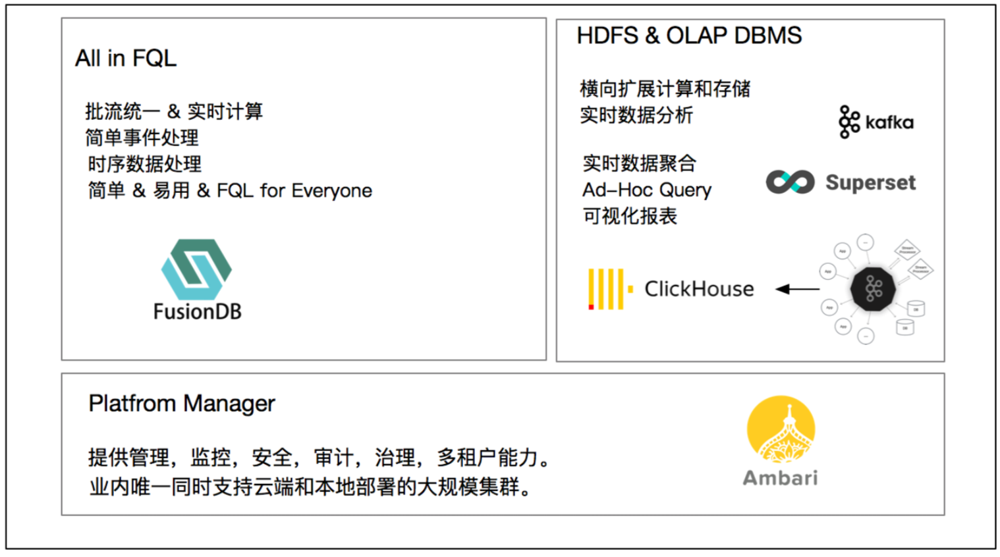

# Installation

This guide covers installing `Anyscale` stack and related software for your local machine, Cloud, and Kubernetes.

`Anyscale` is enterprise Core Data & Core AI unified analysis platform.

企业级 Core Data & Core AI 统一分析平台，简称 Anyscale，寓意：任何环境（local、cloud、kubenetes）、任何规模均能提供稳定可靠的弹性伸缩服务。

Anyscale 不是一个框架，而是一套完整的解决方案，主要包括：

- 基础理念：Anyscale 基于分布式数据存储和混算引擎设计。
- 开发工具：Ambari-Plus，基于 Ambari 源码扩展，Anyscale 更好的融合 Ambari，利用 Ambari 管理 Anyscale 统一分析平台。
- 基础构成：Anyscale 核心基于高性能的分布式 MixedEngine 设计，支撑海量数据实时写入，万亿数据秒级响应能力。
- 核心功能：Anyscale 核心 Core Data & Core AI： - Core Data 提供高度易用的统一数据分析体验，真正的统一 Batch & Streaming & Realtime 计算模型。 - Core AI 提供分布式系统上的 AI 能力，帮助企业智能化转型，提供低 TCO、全自动化、智能化 AI 应用。
- 基础运维：开箱即用，可视化运维管理系统 Ambari Plus: - 提供核心的服务管理与配置中心功能，保障集群的稳定可靠，弹性伸缩。 - 简单高效的管理大规模分布式系统，减少集群的维护成本。

## 设计原则

- Internet of Things (IoT)，连接一切的时代，数据在流动中被处理。
- 简单易用的 SQL，实现跨数据源融合计算能力。
- Anyscale 统一分析平台，简单高性能的数据分析，Core Data 遵循分布式系统设计原则。
- 遵循企业现有服务体系，无缝融入现有企业数据中心系统，可直接交互数据。

## 特性

- One-stop solution：开箱即用 & 简单 & 易用。
- 高性能：万亿数据秒级响应，提供 PB 级数据存储。
- 扩展性：规模化部署，可达几百台集群规模。
- 可视化：可视化的数据收集、数据存储、数据分析、数据报表。
- 可靠性：集群提供副本容错机制，硬件故障不会造成数据丢失。
- 简单运维：日志、监控、报警、配置、服务一栈式管理。
- 简单易用：提供标准 SQL，拖拽式数据分析。
- 数据处理全流程闭环：Load Data -> SQL Analysis -> Save Data
- 跨多云协作、分析、处理数据，例如：S3、ADLS、GCP、OSS 等
- SQL for Everyone & All in SQL

## 什么样的项目适用

混算引擎用于处理海量结构化、非结构化数据，统一存储，提供数据服务。主要如下：

- 即席查询
- 海量数据存储
- 实时数据处理
- 离线数据处理
- 数据可视化
