# Installing by Using Multi Node

通过本教程，我们学习如何一步一步搭建 Anyscale 统一分析平台的分布式版本，小白式装机，让你快速部署并且使用 Anyscale 进行业务应用开发。

如下是一个实例，介绍集群安装需要的硬件、网络、磁盘相关推荐信息。

Anyscale 平台集群版本安装要求至少 3 个节点以上，其中涉及的 `zookeeper`, `kafka`, `clickhouse`，`Hadoop`，`Spark`等都是分布式集群系统，考虑数据存储的可靠性，多节点生产环境，需要大于 5 个节点比较合理，2 个 master 节点，3+ 数据/计算节点，集群规模较大需增加 N 个 Gateway/Client 节点。

<!--IMPORTANT-->

Note: 本篇内容适用于 anyscale 本地数据中心可视化安装，如果是 cloud、kubenetes 按照请参考相应的文档。

<!--END_IMPORTANT-->

## 机架

操作系统版本 CentOs7.2 及以上，需要使用 root 权限进行安装。

| 机柜 | 主机名                                       | 千兆                            | 万兆                        |
| ---- | -------------------------------------------- | ------------------------------- | --------------------------- |
| D01  | node1.fusionlab.cn ... node13.fusionlabe.cn  | 192.15.107.1 ... 192.15.107.13  | 172.16.7.1 ... 172.16.7.13  |
| D02  | node14.fusionlab.cn ... node26.fusionlabe.cn | 192.15.107.14 ... 192.15.107.26 | 172.16.7.14 ... 172.16.7.26 |
| D03  | node27.fusionlab.cn ... node39.fusionlabe.cn | 192.15.107.27 ... 192.15.107.39 | 172.16.7.27 ... 172.16.7.39 |
| D04  | node40.fusionlab.cn ... node52.fusionlabe.cn | 192.15.107.40 ... 192.15.107.52 | 172.16.7.40 ... 172.16.7.52 |
| D05  | node53.fusionlab.cn ... node65.fusionlabe.cn | 192.15.107.53 ... 192.15.107.65 | 172.16.7.53 ... 172.16.7.65 |
| D06  | node66.fusionlab.cn ... node72.fusionlabe.cn | 192.15.107.66 ... 192.15.107.72 | 172.16.7.66 ... 172.16.7.72 |
| D0N  | nodeN.fusionlab.cn ... nodeN.fusionlabe.cn   | 192.15.107.N ... 192.15.107.N   | 172.16.7.N ... 172.16.7.N   |

集群安装前，需要收集集群的网络信息、规范主机名、所属机架，集群规划设计的时候需要使用。

## 网络

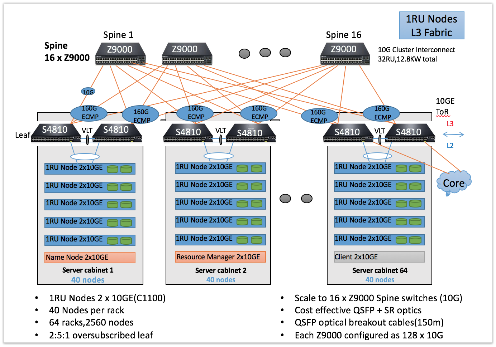

网络是最核心也是最关键的内容，网络会直接影响分布式系统的性能和可靠性，稳定可靠的网络硬件设备以及网络规划尤其重要。

如图，可容纳 2560 个节点的集群网络结构，构建 10GE 网络的庞大集群，网络设备是典型和核心层交换机、汇聚层交换机。图示为 Dell 的交换机产品，类似 H3C、华为也有相关的硬件。需要 Z9000 \* 16 台设备，Z9000 是全 40gb 的汇聚交换。

物理层面划分 64 个 rack，每个 rack 最大可容纳 40 台 1RU 服务器，总共可支撑 2560 个节点。具体部署过程中，注意主节点相关角色放到不同的机架上，Zookeeper 节点放到不同机架。在后续内容有更加详细的介绍。

硬件配置和网络都需要有非常专业的工程师调试，只有所有的环节优化到最佳，方才能在软件层面最大化把硬件资源利用起来，快速完成数据分析任务。

## 磁盘

- ClickServer 的配置： - 2 _ 600G SSD RAID1 安装操作系统，10 _ 2T or 4T SAS/SATA RAID10 Data Storage

- Kafka Broker 的配置 - 2 _ 600G SSD RAID1 安装操作系统、10 _ 2T or 4T SAS/SATA Data Storage

- 设备盘符 - sda：SSD 盘 - sdb-sdm：10 \* SAS/SATA 盘

- CPU 与内存 - ClickServer 配置：32 核 CPU，>= 256G 内存 - Kafka Broker 配置：24 核 CPU，>= 128G 内存

下面图标，介绍不同的角色如何合理的划分磁盘。

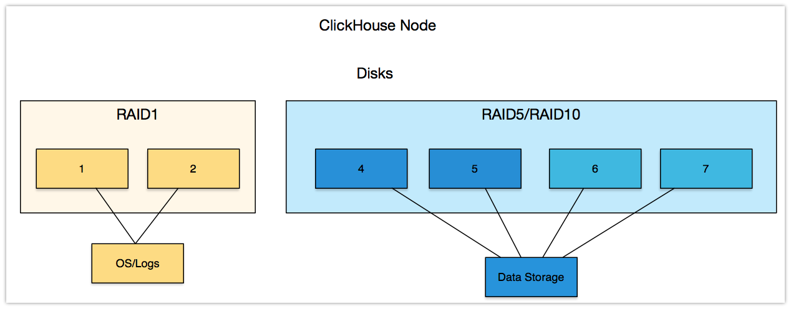

如图 ClickServer Server 节点， 为了保证数据可靠性可做 RAID5/RAID10，也可在数据库启用副本策略支持容错。

有条件的情况，生产环境中尽量保证，重要的角色管理的数据目录在物理上区分开，分而治之，工作负载减少相互干扰，方便管理。

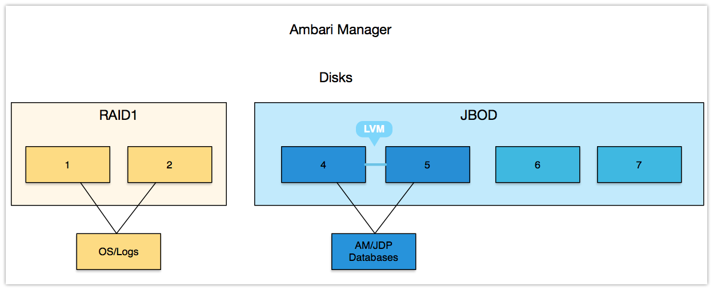

在部署 Ambari Manager 数据库中指定使用 LVM，但 RAID0 也是一种选择。

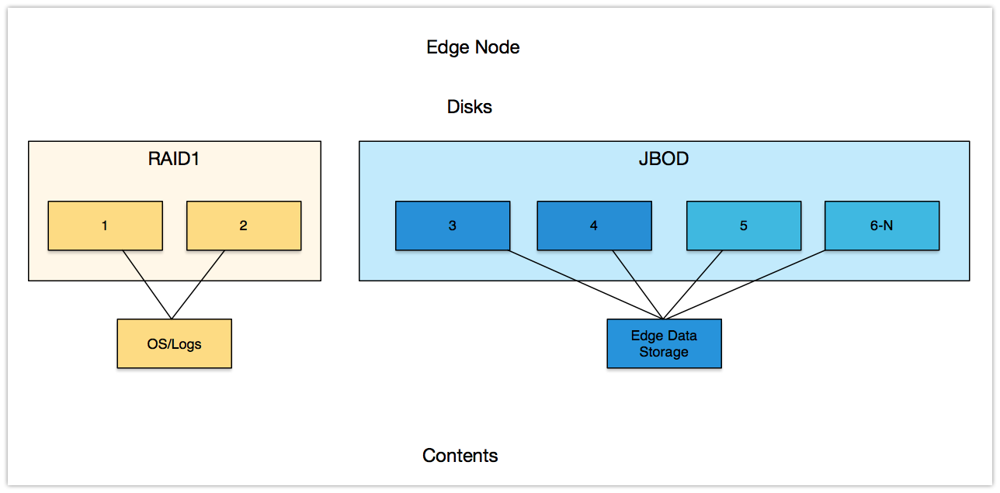

节点操作系统都是 2 块盘做 RAID1，根据不同的角色磁盘划分有区别，在 ClickHouse Server 节点可做 RAID 保障数据可靠性；Kafka Borker 节点，直接使用裸盘挂载存储数据。

其他，相关服务，直接安装于 Edge 节点，在物理目录区分相关数据存储。

集群的安装方式选择 Ambari 来进行自动化安装，目前 Ambari 是开源的大数据管理工具。Ambari 是支持多平台的一款大数据自动化部署和管理软件，我们 Anyscale 是通过 Ambari 来实现自动化管理。

## 分区

Linux 系统分区，在做 Linux 系统分区的时候， 决定了后续集群是否能够在底层提供合理的数据存储保障能力。比如：操作系统 ”os/log” 需要安装在 SSD，那么 SSD 需要 2 块做 raid1,保障即使有一块盘损坏，保障集群操作系统正常运行。

<!--IMPORTANT-->

Notes：Linux 系统安装的时候，请使用最小化安装方式，不安装图形化界面.

<!--END_IMPORTANT-->

ClickHouse Server 节点分区方式：

| Directory    | Size                         | Linux Version |
| ------------ | ---------------------------- | ------------- |
| /boot        | 500 MB                       | CentOS 7.2    |
| swap         | 30GB                         | CentOS 7.2    |
| /            | 100GB                        | CentOS 7.2    |
| /var         | 300 GB                       | CentOS 7.2    |
| /data{1..12} | ClickHouse/Kafka Borker Data | CentOS 7.2    |

如上举例，根据实际情况进行调整，需要注意的第一点是 /var 目录单独分出来，避免日志太多导致根目录爆满，导致操作系统无法正常工作。第二点，ClickHouse Server 数据存储目录，底层硬盘为 RAID5/RAID10，裸盘也没问题，但是得保障在 ClickHouse 集群层面有多数据副本。第三点，ClickHouse Server 存储一般需要非常大的空间，因为所有的集群数据都存储在 ClickHouse Server 管理的磁盘上， 建议单块盘大小 2-4T。

由于 ClickHouse Server 不支持多目录存储数据，只能固定在一个存储路径。官方建议可以通过软连接解决往多块盘同时写的问题，在未来版本中会支持多存路径。

Ambari-Server 节点分区方式：

| Directory   | Size                     | Linux Version |
| ----------- | ------------------------ | ------------- |
| /boot       | 500 MB                   | CentOS 7.2    |
| swap        | 30GB                     | CentOS 7.2    |
| /           | 100GB                    | CentOS 7.2    |
| /var        | 100 GB                   | CentOS 7.2    |
| /data{1..2} | 2T - 4T （monitor data） | CentOS 7.2    |

这是一个例子，对于集群监控主节点的部署，使用 Ambari-Server 监控集群或者其他集群监控工具，原则是操作系统建议使用 lvm 分区管理，方便动态扩展容量，避免出现某些目录占满的情况。监控相关的数据一定要放到大盘去存储，设置好数据清理周期，避免存储数据过大，导致查询时主节点压力过大。

Gaeteway-Node 节点分区方式：

| Directory   | Size             | Linux Version |
| ----------- | ---------------- | ------------- |
| /boot       | 500 MB           | CentOS 7.2    |
| swap        | 30GB             | CentOS 7.2    |
| /           | 200GB            | CentOS 7.2    |
| /var        | 100 GB           | CentOS 7.2    |
| /data{1..5} | 2T - 4T （data） | CentOS 7.2    |

Gateway 节点，没有任何集群服务和组件，通常是用来和集群沟通提交任务的节点，主要功能，在 Anyscale 集群中提供一个桥梁，可以对数据进行接入 。Gateway 节点链接到主要局域网的入口， 有时也被称作网关节点。Gateway 节点是可选或者不选择的，但常被强烈推荐，对集群瓶颈和性能均有很大的提升作用。

Linux 系统分区方案说明：

在很多业务服务器数量多且复杂的运维场景，会有专门的系统安装工程师，由于这些基础系统安装工程师无法确定服务器的业务需求，因此，会根据公司的要求只分出：

- /boot 200M
- Swap 内存\*2
- / （列如： 200G）

然后剩余的分区保留不分，fdisk(不适合大于 2t 的分区)，parted(适合大于 2T 的分区) 这样后续使用的服务器的不同业务产品的运维部门就可以根据具体的业务在规划后面的分区，这样的方法也是值得推荐的分区思路！

上面的/data{1..12}目录，表示，如果有 12 块硬盘，挂载点为 12 个目录，取名/data1, /data2, /data3, /data..这些目录都用来存储 ClickHouse/Kafka Broker 数据的数据目录！

有关根目录/ ，主要是存储/home，/tmp，/opt 等！

有关/var 目录主要存储相关组件所有的日志记录信息，所以单独划分，避免根目录出现使用 100%的情况，导致操作系统无法正常工作。

## 角色

由于您选择使用 Ambari Manager 进行集群的自动化部署方式，下面图表显示了在大多数集群的安装时合理化的角色划分方式。

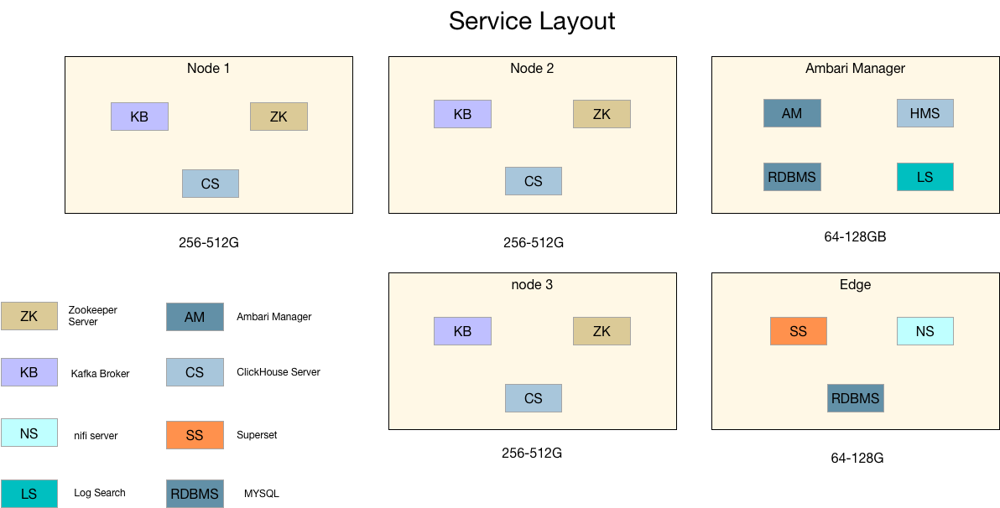

我们建议每个 ClickHouse Server 节点内存 256-512G。内存相对便宜，并且随着对计算引擎越来越高的要求，引入内存计算充分利用内存，快速响应。

角色分配原则，有单点的问题的服务集中在一台机器，方便管理，可视化相关对外提供服务部署在 Edge 节点。如果监控节点(Ambari Server)没有 HA 功能，可以通过定时对监控服务节点进行备份数据和数据库快照，即使在监控服务器损坏的情况下，依然可以通过数据库备份数据在一个全新的服务器上恢复监控服务，而不会影响任何管理组件的正常运行。

目前 Ambari Server 是可以支持迁移到新的服务器节点恢复，可以参考我的历史文章。

需要注意，在大集群(50+ 节点)中，一定要提前统计好服务器所属机架，方便管理和服务分配。

- Server Node：ClickHouse Server、Kafka Borker、ZKServer、Spark HistoryServer
- Ambari Manager：Ambari Server、ZKServer

ZKServer 保证奇数个节点，这里涉及到 3 个管理节点，物理上对应着 3 台物理服务器，在物理逻辑上保证他们尽量放置于不同的机架。

接下来，我们将介绍如何安装 Anyscale 平台。

## 安装

### 必备条件

[1] 选择操作系统版本

关于支持的操作系统

> 目前仅支持 R 系列操作系统 7.x 版本，比如：centos/redhat 7.2,7.3,7.4。

<!--IMPORTANT-->

Note：本篇基于 7.4.1708 (Core) 版本安装，如果尝试在其他系列（Ubuntu、Debian）的系统安装，安装失败属于正常现象，我们还未提供支持。

<!--END_IMPORTANT-->

[2] Ambari-server 所在的服务器能够 ssh 免密码登录到全部主机。

[3] 全部主机关闭 selinux

<!--TABS-->

<!--Linux / OSX-->

```bash
setenforce 0  &&
sed –i 's#SELINUX=enforcing#SELINUX=disabled#g' /etc/selinux/config
```

<!--Ubuntu-->

```bash
unsupported
```

<!--END_TABS-->

[4] 节点主机名统一格式

例如：

```bash
	ClickHouse Server: node{001..100}.fulsionlab.cn
```

[5] 全部主机名和 IP 地址进行映射 hosts

[6] 全部机器关闭防火墙

<!--TABS-->

<!--Linux / OSX-->

```bash
systemctl stop firewalld.service &&
systemctl disable firewalld.service
```

<!--Ubuntu-->

```bash
unsupported
```

<!--END_TABS-->

[7] 全部主机必须通过 ntp 服务使时间保持一致。

公网 NTP 同步；如果是内网，需要自己做一个内网的 NTP 服务器；让服务器时间和硬件时钟同步，避免重启操作系统导致时间不同步，集群组件无法正常工作。

<!--TABS-->

<!--Linux / OSX-->

```bash
ntpdate asia.pool.ntp.org &&
hwclock -w
```

<!--Ubuntu-->

```bash
unsupported
```

<!--END_TABS-->

集群组件利用时间戳进行存储的，需要保障集群所有节点时间一致性，不然会导致集群异常，目前在分布式数据库领域，对于分布式集群时间一致性的误差不能超过秒级，在 Anyscale 中 Zookeeper 组件，如果在集群安装之前你没有主动的去让所有节点时间一致，安装完成之后再去同步时间，会导致依赖 Zookeeper 服务的 ClickHouse 不能正常工作。

目前 NewSQL 数据库系统也是严格要求必须保证同一数据中心时间一致，甚至通过硬件时钟来做时间同步。

[8] 安装 epel-release(可选)

<!--TABS-->

<!--Linux / OSX-->

```bash
yum install epel-release -y
```

<!--Ubuntu-->

```bash
unsupported
```

<!--END_TABS-->

因为 Anyscale 中的 Superset 组件，支持异步数据查询，依赖到 epel 源中的 lapack、openblas-devel 优化的 BLAS 库。

### 制作本地源

Anyscale 支持在线安装和离线安装两种模式。但由于是个人开发者，能力有限，目前线上服务器提供可部署的 Anyscale 二进制文件流量已经比较可观，为了不对我的 VPS 服务器造成太大压力。故而建议大家使用离线安装包部署的方式，由于涉及到多个分布式系统融合，所以软件包比较大。

全靠个人收入支撑服务器，所以希望多多包涵。

接下来，我接受一下 Anyscale 离线安装的方法。

你可以选择集群任意节点安装 httpd 服务，如下考虑在你没有内网源服务器的情况下进行的操作。

[1] 安装 httpd 服务

<!--TABS-->

<!--Linux / OSX-->

```bash
yum install httpd
```

<!--Ubuntu-->

```bash
unsupported
```

<!--END_TABS-->

[2] 启动 httpd 服务

如果你按照之前的必备条件准备，并且选择集群任意节点做为 httpd 服务器，那么直接启动即可。

如果你选择的一台全新服务器安装 httpd，没有使用集群节点，那么你需要关闭 selinux 和 firewalld。

<!--TABS-->

<!--Linux / OSX-->

```bash
systemctl start httpd

systemctl enable httpd
```

<!--Ubuntu-->

```bash
unsupported
```

<!--END_TABS-->

[3] 下载 JDP-3.2.0.0 安装包

<!--TABS-->

<!--Linux / OSX-->

```bash
wget http://www.fusionlab.cn/jdp/repo-as-tarball/3.2.0.0/JDP-3.2.0.0-centos7-rpm.tar.gz
```

<!--Ubuntu-->

```bash
unsupported
```

<!--END_TABS-->

<!--IMPORTANT-->

软件包比较大，大约需要下载 5min

3% [=> ] 93,634,920 7.11MB/s eta 5m 33s

由于 Anyscale 下载量太大，导致国外的 IP BLACKED，已无法稳定使用。

所以，提供百度云盘，下载地址：

链接:https://pan.baidu.com/s/1Xgh-PbPURgSYG2XUJOU6HA

密码:frsj

<!--END_IMPORTANT-->

[4] 解压 JDP-3.2.0.0 到/var/www/html 路径

<!--TABS-->

<!--Linux / OSX-->

```bash
mkdir /var/www/html/jdp/

tar -zxvf JDP-3.2.0.0-centos7-rpm.tar.gz -C /var/www/html/jdp/
```

<!--Ubuntu-->

```bash
unsupported
```

<!--END_TABS-->

[5] 验证 Anyscale 源可用性

<!--TABS-->

<!--Linux / OSX-->

```bash
$ pwd
/data/nginx/html

$ tree -L 2 jdp/centos7/
jdp/centos7/
├── 3.x
│   ├── 3.2.0.0
│   ├── ambari
│   ├── ambari.repo
│   └── jdp-3.2.repo
└── utils
    └── 1.1.0
```

<!--Ubuntu-->

```bash
unsupported
```

<!--END_TABS-->

访问 `http://you_httpd_ip/jdp/centos7/3.x/` ，如下图。

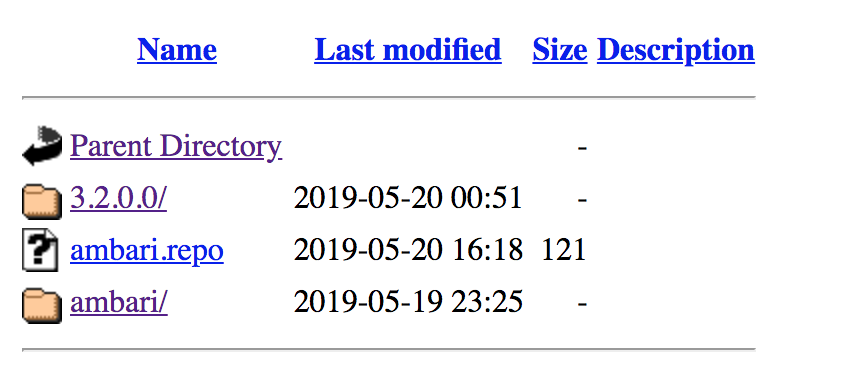

使用 yum search 验证源是否可用。

<!--TABS-->

<!--Linux / OSX-->

```bash
wget http://you_httpd_ip/jdp/centos7/3.x/ambari.repo -O /etc/yum.repos.d/ambari.repo
```

<!--Ubuntu-->

```bash
unsupported
```

<!--END_TABS-->

修改 ambari.repo 中的 `baseurl=http://you_httpd_ip/jdp/centos7/3.x/ambari/`

执行如下命令：

<!--TABS-->

<!--Linux / OSX-->

```bash
yum search ambari
```

<!--Ubuntu-->

```bash
unsupported
```

<!--END_TABS-->

如果有 ambari 软件信息，那么恭喜你，Anyscale 离线源成功了。

### Ambari-plus 安装

[1] ambari-server 节点生成相关的 repo 文件，命令如下：

<!--TABS-->

<!--Linux / OSX-->

```bash
curl http://you_httpd_ip/jdp/centos7/3.x/ambari.repo > /etc/yum.repos.d/ambari.repo
```

<!--Ubuntu-->

```bash
unsupported
```

<!--END_TABS-->

修改 ambari.repo 中的 `baseurl=http://you_httpd_ip/jdp/centos7/3.x/ambari/`

[2] 安装 ambari-server

<!--TABS-->

<!--Linux / OSX-->

```bash
yum install ambari-server -y
```

<!--Ubuntu-->

```bash
unsupported
```

<!--END_TABS-->

[3] 配置 Ambari-Server 的 Anyscale，Anyscale 平台所需 JDK 必须 >= 1.8

<!--TABS-->

<!--Linux / OSX-->

```bash
wget http://www.fusionlab.cn/jdp/artifacts/jdk-8u112-linux-x64.tar.gz -O /var/lib/ambari-server/resources/jdk-8u112-linux-x64.tar.gz
wget http://www.fusionlab.cn/jdp/artifacts/jce_policy-8.zip /var/lib/ambari-server/resources/jce_policy-8.zip
```

<!--Ubuntu-->

```bash
unsupported
```

<!--END_TABS-->

<!--IMPORTANT-->

由于 Anyscale 下载量太大，导致国外的 IP BLACKED，已无法稳定使用。

现在，提供百度云盘，下载地址，注意 JDK 需要验证策略文件，百度云 Download 请参考如上操作：

链接: https://pan.baidu.com/s/1Xgh-PbPURgSYG2XUJOU6HA

密码: frsj

<!--END_IMPORTANT-->

[4] ambari-server setup

<!--TABS-->

<!--Linux / OSX-->

```bash
# ambari-server setup
Using python  /usr/bin/python
Setup ambari-server
Checking SELinux...
SELinux status is 'enabled'
SELinux mode is 'permissive'
WARNING: SELinux is set to 'permissive' mode and temporarily disabled.
OK to continue [y/n] (y)?
Customize user account for ambari-server daemon [y/n] (n)?
Adjusting ambari-server permissions and ownership...
Checking firewall status...
Checking JDK...
[1] Oracle JDK 1.8 + Java Cryptography Extension (JCE) Policy Files 8
[2] Custom JDK
==============================================================================
Enter choice (1): 1
To download the Oracle JDK and the Java Cryptography Extension (JCE) Policy Files you must accept the license terms found at http://www.oracle.com/technetwork/java/javase/terms/license/index.html and not accepting will cancel the Ambari Server setup and you must install the JDK and JCE files manually.
Do you accept the Oracle Binary Code License Agreement [y/n] (y)? y
Downloading JDK from http://www.fusionlab.cn/jdp/artifacts/jdk-8u112-linux-x64.tar.gz to /var/lib/ambari-server/resources/jdk-8u112-linux-x64.tar.gz
jdk-8u112-linux-x64.tar.gz... 100% (174.7 MB of 174.7 MB)
Successfully downloaded JDK distribution to /var/lib/ambari-server/resources/jdk-8u112-linux-x64.tar.gz
Installing JDK to /usr/jdk64/
Successfully installed JDK to /usr/jdk64/
Downloading JCE Policy archive from http://www.fusionlab.cn/jdp/artifacts/jce_policy-8.zip to /var/lib/ambari-server/resources/jce_policy-8.zip

Successfully downloaded JCE Policy archive to /var/lib/ambari-server/resources/jce_policy-8.zip
Installing JCE policy...
Check JDK version for Ambari Server...
JDK version found: 8
Minimum JDK version is 8 for Ambari. Skipping to setup different JDK for Ambari Server.
Checking GPL software agreement...
GPL License for LZO: https://www.gnu.org/licenses/old-licenses/gpl-2.0.en.html
Enable Ambari Server to download and install GPL Licensed LZO packages [y/n] (n)?
Completing setup...
Configuring database...
Enter advanced database configuration [y/n] (n)?
Configuring database...
Default properties detected. Using built-in database.
Configuring ambari database...
Checking PostgreSQL...
Running initdb: This may take up to a minute.
Initializing database ... OK


About to start PostgreSQL
Configuring local database...
Configuring PostgreSQL...
Restarting PostgreSQL
Creating schema and user...
done.
Creating tables...
done.
Extracting system views...
ambari-admin-2.7.0.0.0.jar
Error extracting ambari-views-package-2.5.0.0.0.jar
....
Ambari repo file doesn't contain latest json url, skipping repoinfos modification
Adjusting ambari-server permissions and ownership...
Ambari Server 'setup' completed successfully.
```

<!--Ubuntu-->

```bash
unsupported
```

<!--END_TABS-->

ambari-server 启动成功，开始安装 Anyscale 集群。

### 集群安装

浏览器输入http://your_ambari-server_ip:8080/#/login 用户名：admin 密 码：admin

通过登录页面进入集群安装向导，如下:

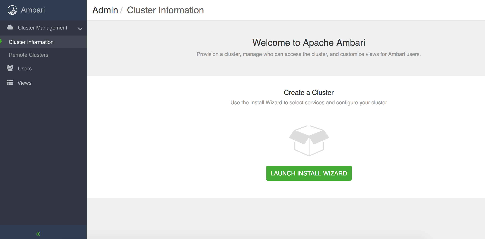

鼠标单击”Launch Install Wizard”按钮，通过 10 个 setup 引导步骤，进行可视化的集群安装。

#### Step1 - Get Started

步骤 1，需要填入一个集群名称 Cluster Name，点击下一步。例如：

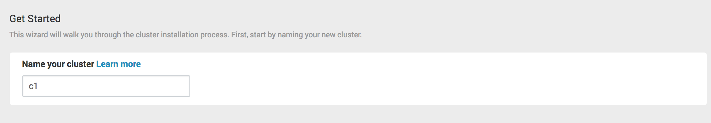

#### Step2 - Select Version

选择 Anyscala 的版本，默认支持 3.2 版本的安装部署，鼠标点击“Use Local Repository”填入之前制作的本地仓库源地址,点击下一步：

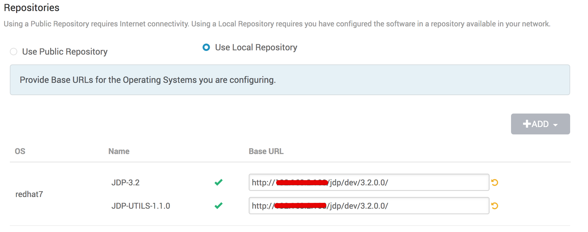

如上图，默认支持 redhat7：

- JDP-3.2 Base URL：http://you_httpd_ip/jdp/centos7/3.x/3.2.0.0
- JDP-3.2 JDP-UTILS-1.1.0 Base URL：http://you_httpd_ip/jdp/centos7/3.x/3.2.0.0

#### Step3 - Install Options

填写需要安装的目标主机节点的 hosts 映射名称，私钥信息填写为 ambari-server 所在节点，可以免密码登录所有节点的用户私钥信息。例如：一般通过 root 用户进行集群的安装，如下填写 root 用户`/root/.ssh/id_rsa`文件内容。

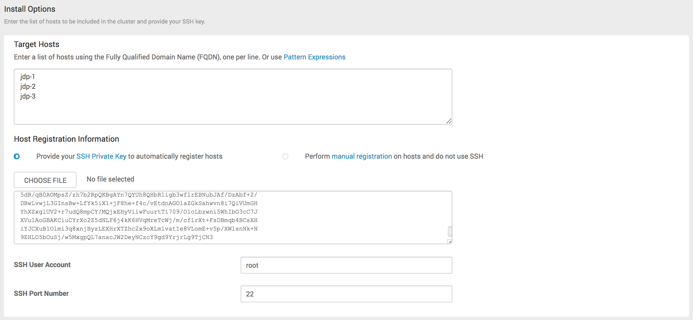

点击“Register and Confirm”进入下一步。

#### Step3 - Confirm Hosts

在这个步骤 ambari-server 节点会并行去多台机器执行相关命令。首先 scp 相关的 ambari-agent 的 setup 脚本到多台机器，然后并行执行相关的命令进行 ambari-agent 的安装，注册 ambari-agent 节点到 ambari-server。这里主要工作是在所有节点安装 ambari-agent，并且把 ambari-agent 注册到 ambari-server，让 server 可以控制所有的 agent 节点。之后 ambari-server 就可以控制所有的 agent 执行命令进行 Anyscale 集群的安装；自动注册用到了 ssh 免密码登录，这就是为什么需要 ambari-server 所在节点需要可自动化登录到所有受管理节点的权限。

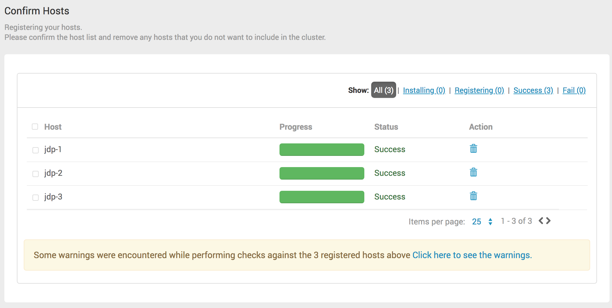

点击“Next”继续安装。

#### Step4 - Choose Services

选择你需要安装的服务，目前 Anyscale 提供 12+ 个组件的自动化安装和部署维护。如下图所示：

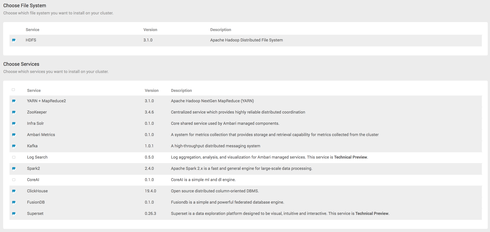

你需要勾选的服务如上所示，进行 Anyscale 集群的安装，点击 Next。

#### Step5 - Assign Masters

分配主节点所在主机，在分布式软件系统中，默认 ClickHouse Server/Kafaka `+`支持多节点。如下图：

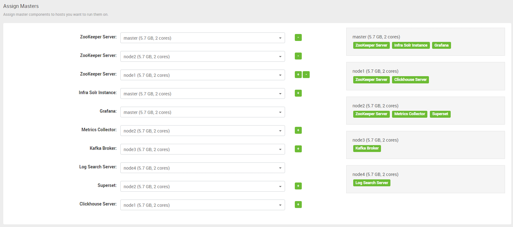

如下 3 个节点 clickhouse server 集群角色分配：

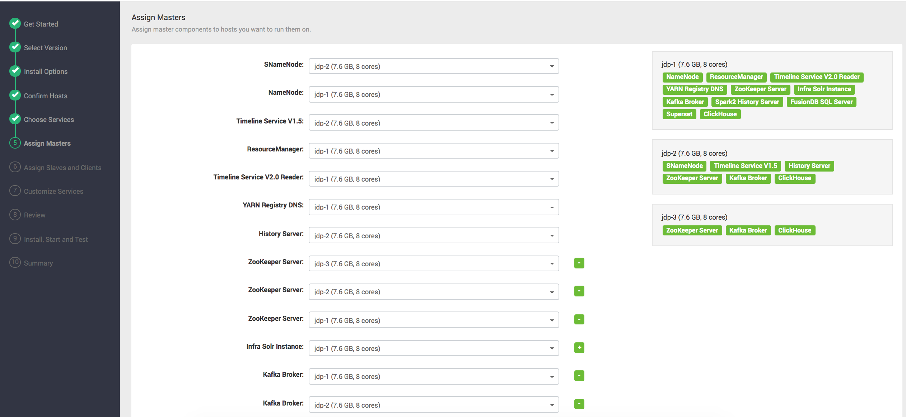

clickhouse，zookeeper 与 kafka broker 对 ambari 来说是比较特殊的系统，因为他们是无中心设计，很多大数据系统都是 Master-Slave 设计，Ambari 更擅长管理主从集群，通过他们安装向导你就能体会到，因为 ambari 最初是为 Hadoop 生态圈服务，我们对它进行改造服务于 Anyscale。

必须安装的相关服务选项，集群安装成功后，也可添加或删除服务，是非常灵活的。

关于上百个节点 clickhouse server 安装管理，可能会稍显麻烦，我们在以后版本中会进一步完善。

#### Step6 - Assign Slaves and Clients

选择从节点和客户端所在主机，从节点和客户端是可以有多个的，可以进行自定义，默认会根据硬件做最小化选择从节点和客户端，这里可以根据需要选择从节点的分配。

- 从节点 – 有 n 个，一个节点就代表一台物理主机或者虚拟主机。
- 客户端 – 有 n 个，一般是客户机上需要安装客户端，让客户机可以访问集群服务。

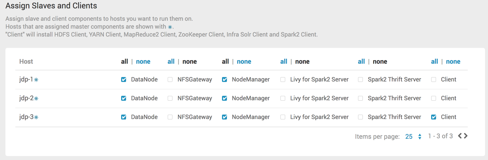

#### Step7 - Customize Services

自定义服务器配置，在这个步骤可以修改一些默认识别的参数，比如：ClickHouse 存储的数据存储目录，Kafka/zookeeper 存储数据的目录，最好在底层存储盘把他们隔离开来，因为它们的 IO 需求不同。

服务，需要自己根据提示输入一些用户密码的内容，请牢记相关服务器输入的用户密码，因为这些会在后台 Ambari-server 数据库中创建相应的数据库。指不定那天就需要登录后台数据库解决一些问题。

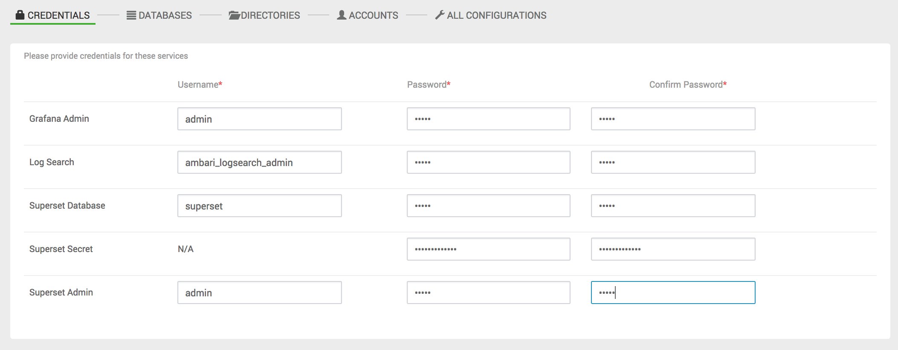

填写相关用户密码信息时，Anyscale 需要注意一下几点：

[1] Ambari Metrics

<!--TIP-->

Grafana Admin Password 密码，用于登录 Grafana 监控平台，监控集群相关服务的监控情况。

<!--END_TIP-->

[2] ClickHouse

<!--TIP-->

ClickHouse Server 默认数据存储路径/data/clickhouse 目录，如果此目录不存在自动创建， 不建议修改。
Advanced clickhouse-config 选项卡 path 中修改，tmp_path 也请做相应修改。
已经支持 90%左右的 clickhouse server 配置并且有相关配置信息提示，吐血梳理。
默认生成两个 clickhouse user 用户，用户登录 clickhouse，进行相关操作。

- 管理员用户：admin/admin
- 只读 ck 用户：ck/admin

<!--END_TIP-->

[3] Superset

<!--TIP-->

Superset Secret Password, 请输入带有数字和字符的密码信息
Superset Admin Password，填写管理员密码
Superset Database Password，填写数据库密码

<!--END_TIP-->

请牢记用户密码信息，在登录 superset 时需要使用到。

点击，`Next` 进入下一步。

- DATABASES，Superset 数据库可持久化，默认使用：SQLITE，点击 Next 下一步。
- DIRECTORIES，设置组件 DATA DIRS，有默认值，点击 Next 下一步。 - ZOOKEEPER - INFRA SOLR - AMBARI METRICS - KAFKA - LOG SEARCH

- ACCOUNTS，点击 Next 下一步。
- ALL CONFIGURATIONS，设置组件 CONFIGURATIONS，点击 Next 下一步。

<!--NOTE-->

注意：ClickHouse CONFIGURATIONS DATA DIR，默认路径：/data/clickhouse，可根据实际情况进行修改。

<!--END_NOTE-->

#### Step8 - Review

在安装之前预览集群服务分配和节点相关信息是否正确，`Print` 输出集群相关信息，如果检测没有任何问题，你就可以进行下一步 `Deploy` 了。

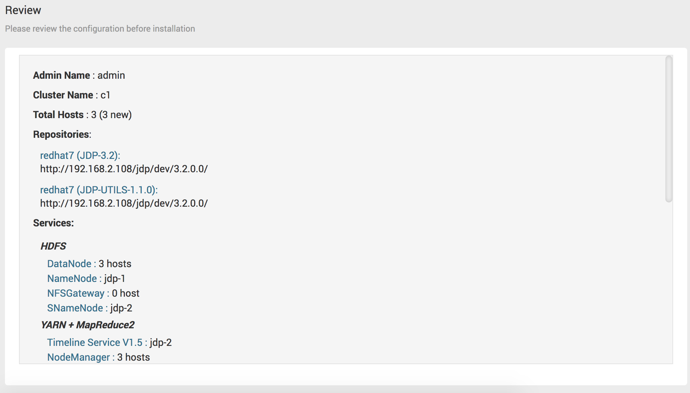

#### Step9 - Install, Start and Test

自动化安装、启动集群、自动化 Test 集群，根据你的硬件环境和网络相关因素，你需要等待一段时间，等集群自动化安装成功，全部主机 `Status` 都变成绿色进度条，那就可以点击 `Next`。

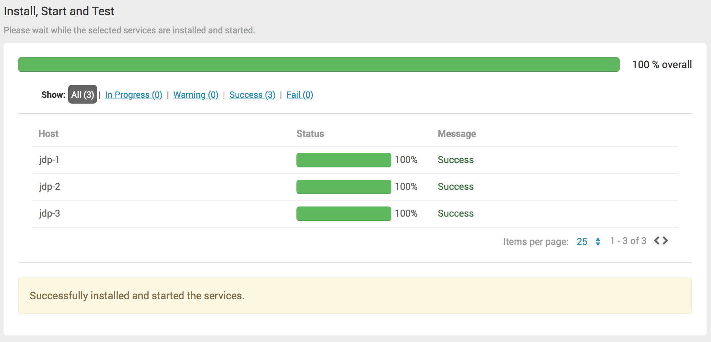

#### Step10 – Summary

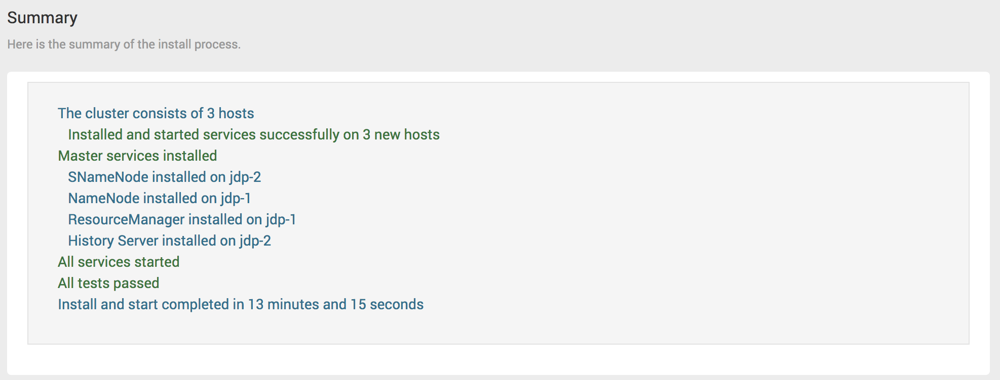


至此、集群安装完毕，开启你的 Anyscale 集群之旅吧。

<!--NOTE-->

The `docker-compose-anyscale.yml` expects an existing Docker image: `fusionlab/anyscale-1.0.0.0` with a Tag that matches the configured `ANYSCALE_VERSION` value.

<!--END_NOTE-->
