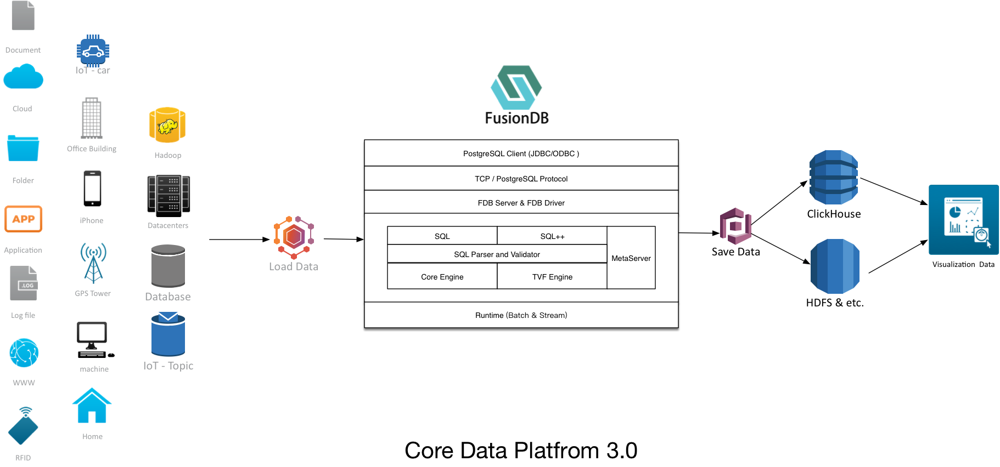

# 架构

企业级 Core Data & Core AI 统一分析平台。

## CoreData

Core Data 是企业核心数据管理平台，拥有强大易用的数据加载、数据分析、数据可视化能力。

数据分析核心引擎 FusionDB，一个高性能 & 简单易用真正实现批流统一的分布式数据库引擎。

- FusionDB - 批流统一 & 实时计算，实现跨数据源的融合分析。

### Batch

FusionDB 静态数据计算引擎，利用强大 Data Source Connect 实现各种数据源的融合计算，每一种数据源都有标准的 Schema 描述，支持动态加载数据到 FusionDB，在 FusionDB 中一切数据都是 Table，任何的数据源都支持 ALL in SQL, 利用 SQL 的强大数据处理能力，实现跨数据源的融合的分析；SQL for Everyone 简单 & 易用 & 灵活。

FusionDB 支持简单事件、时序数据处理，拥有强大的海量数据处理能力。

### Stream

FusionDB 动态计算引擎，分布式实时计算 Core Engine 中实时流动的数据，利用 Meta 中提供的 Schema，实现低延迟分析海量数据，提供实时数据服务。

Core Data 核心功能：

- Data Load - 分布式批 & 流统一引擎 - SQL for Everyone - 跨数据源加载数据 - SQL 数据预处理 - 高效率 & 谓词下推

- SQL - 事件 & 时序处理 - 流数据处理 - 高性能 & 低延迟 - 动态数据表 - 可变 Schema - 简单 & 易用 SQL

- Save Data - 实时数据分发 - 批量数据分发 - 简单强大的 Policy engine - 基于 SQL 简单易用

- Distributed Database - 高性能 & 低延迟分析 - 分布式 SQL 引擎 - 海量数据存储 - 多租户 & 授权 & 资源管理 - 设计简洁 & 线性扩张 - 高可靠，无中心、数据分片 - 跨数据源融合能力

- Visualization Data - 丰富的数据可视化集 - 易于使用的界面，用于探索和可视化数据 - 创建和共享仪表板 - SQLAlchemy 与大多数 DBMS 集成 - 可扩展的，细粒度的安全/权限模型

Anyscale 数据融合引擎 FusionDB。

- Load Data - 分布式数据加载引擎。

- Save Data - 分布式数据存储引擎。

Load Data 是 FusionDB 中的数据加载引擎，它将 Anyscale 平台中提供的 Kafka、HDFS、ClickHouse 与其它系统融合在一起，目的是充当企业数据融合管道，轻松将各种复杂的数据系统相互融合。

需要融合其他业务系统数据到 ClickHouse，Load Data 提供强大的 SQL 数据处理能力，在数据加载的过程中进行处理，而且兼容 MySQL 协议非常方便易用。

Save Data 数据分发引擎，数据计算或者流转会在分布式计算引擎中，流转过程中可基于 SQL 进行数据聚合实时反馈业务系统，供实时大屏或监控系统使用。

Save Data 数据分发引擎，配置数据计算间隔和持久化周期，数据量累计到一定程度，我们会以 Batch 的方式，每隔一段时间周期性把数据入库到 ClickHouse 集群或其他业务系统，ClickHouse 建议批量导入数据，每次个批次数据集大于 10w。

FusionDB 是整个 Anyscale 平台的核心，提供分布式数据库功能。此外我们还提供更多的选择，如：你可以通过 Load Data 中数据流转视图功能，将数据从一个系统(例如：RDBMS 导入到 Kafka)，利用 Save Data 数据存储引擎，将动态计算的结果分发到各个业务系统(例如：Kafka Topic 内容到 HDFS File/ClickHouse/RDBMS/etc)

Load Data & SQL Analysis & Transferd Data

FusionDB 提供跨数据源的数据融合功能，目前支持 SQL，兼容标准的 SQL + StreamSQL，在数据流转过程中可提供强大的数据分析能力，对数据进行复杂的实时或批量计算，计算结果 Save 到任意的数据存储系统，可对外提供数据服务。

FusionDB 提供流数据与 Batch 数据处理，处理结果可以 Save 到 ClickHouse 或者其他数据系统，简单 & 易用的 SQL，计算结果存储到 ClickHouse 或者其它业务系统。

## CoreAI

Core AI 核心功能：

> 待续。。。
